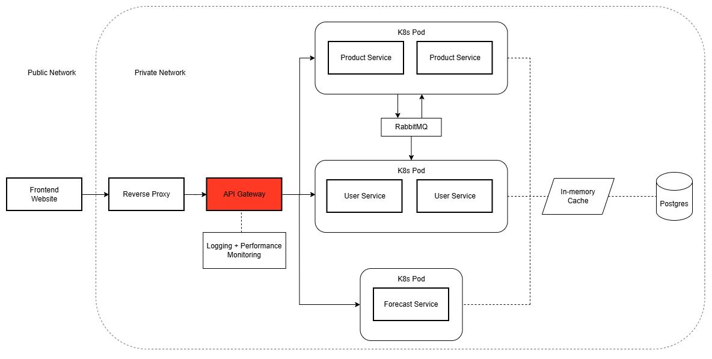

# API Gateway

This service handles:
- Routing Requests
- Authenticating Requests
- CORS Configuration

The diagram below highlights where in our architecture the API Gateway operates.

  

## Tech Stack

### Core & Build

### Deployment

## Contribution

**Author: Daniel Jackson**
- Setup this routing service to manage sending request to the right service, using pattern matching based on the URL.
- Configured CORS so the production website and development environments can send requests to the backend.
- Setup Authentication Security Filter that:
    - Verifies token signature for authenticity
    - Verifies token has not expired
    - Written explicit paths that are exempt from authentication (E.G Endpoint Documentation Website)
    - Used Maven Licensing Plugin to check permissions of dependency licenses (Software Inventory)
- Created README file to show details about the repository

 

**Author: Jed Leas**

- Setting up all CI/CD workflows to handle
  1. Automatic testing on push of main branch on the API Gateway repository
  2. Automatic Deployment onto k3s with zero downtime on completion of automatic testing so broken code won't make it to deployment
- Helped Daniel Jackson in the diagnosis and fixing of the CORS Errors and configuration.

